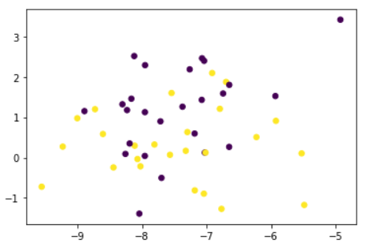
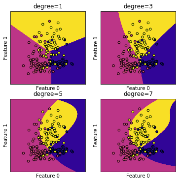

摘要：支持向量机（SVM）是一类按监督学习方式对数据进行二元分类的广义线性分类器，早在1964年就已经被提出，虽然现在我们常用的机器学习算法是神经网络，但是SVM在处理小量数据中仍存在着一定的优势

关键字：支持向量机（SVM），机器学习算法，Python

## 一、引言
支持向量机是一类按监督学习方式对数据进行二元分类的广义线性分类器，虽然相比较于神经网络，这种分类算法有所失宠，但是其并非毫无价值，当数据集中样本特征的测度比较接近，例如在图像识别领域，还有样本特征数和样本数比较接近时，SVM处理起来都会游刃有余。同时对SVM的学习也可以加深对其他机器学习算法的理解。此文就支持向量机的代码实现以及相关参数调节的效果进行分析。
## 二、SVM原理简析
通俗易懂的讲，对于两组二维的数据，如图：
   

若每个点表示一个数据，对于前一组数据，我们可以找到一条直线将数据分成两类，我们可以称前一组为线性可分，而后一组则线性不可分。事实上，线性可分性的定义：若输入数据所在的特征空间存在作为决策边界的超平面将学习目标按正类和负类分开，并使任意样本的点到平面距离大于等于1 ，则称这类问题具有线性分类性。[1]
支持向量机通过获得与所有点的距离都大于1的边界，将数据分为两类。
 

然而对于图一中右图这种无法线性分类的情况，我们应该怎样解决呢？支持向量机（SVM）可以通过核函数，将二维数据变为三维数据：
 

那么将两组数据进行分类的平面，如果重新投影到二维中，效果可能是这样的：
 

显然，此时支持向量机可以实现线性不可分的分类问题，这也是它将线性不可分的问题进行分类的原理。
## 三、支持向量机的核函数和分类效果
由上述内容我们知道了支持向量机的核函数可以将本来无法线性分类的数据给进行线性分类。同时，支持向量机的核函数也并不止一种，包括：多项式核（polynomial kernel）、径向基函数核（RBF kernel）、拉普拉斯核（Laplacian kernel）、Sigmoid核（Sigmoid kernel）等，最常用的两种为：多项式内核和径向基内核。SVM使用不同核函数的分类效果存在一定的不同，这是由于数据点之间的距离公式不同所致，下图为四种核函数下的分类效果图：
 

 
 
从图中，我们可以看到这四种核函数的分类效果有着较大的区别，后两者为线性核函数，因此在线性不可分的情况下效果不一定会很好，而前两者则更加弹性。在前两种核函数中，起决定性作用的参数是不同的，对于RBF而言，起决定性作用的参数为：gamma和C，对于polynomial而言，起决定性的参数为degree和C。
## 四、核函数的参数和分类效果
在线性不可分的数据中使用支持向量机时，参数的选择会对分类的效果产生较大的影响。
首先对于RBF核函数，通过调整python库sklearn中svm.SCV的gamma参数即可实现不同的效果：
 

在图中，我们显然能看出三者的区别，简而言之，随着gamma值增大，模型会将每一个点都放在其边界内，而gamma较小的则显着较为光滑。那是不是gamma值越大，在数据集上的分类效果就会越好？并非如此。在训练集上的效果随着gamma增大，会导致过拟合现象，不一定适用于测试集或是数据集，同时，在gamma值较小的时候又会导致欠拟合。因此在进行训练时，应当根据其在测试集上效果不断地调节相应的参数，从而达到较好的效果。
对于Polynomial的degree参数，通过不断调整python库sklearn中svm.SCV的degree参数，可以得到如下图的效果：
 

	从图中可以看出，随着degree值的增大，分类效果微弱的变好，但是并非十分明显，同时，degree值的增大会导致运算量增大，从而需要较多的时间，当degree值为12时，即使只有这些数据，在电脑上的运行时间也已经较为漫长了，因此不做细究。
## 五、小结
至此，简要的分析了支持向量机的原理，调整核函数、以及相关参数对分类效果的影响，虽然没有对实际的例子进行测试，但是就上述的效果可以看出，在小数据的情况下，支持向量机还是可以有较好的效果。尽管在神经网络横行的今天，支持向量机可能会逐渐的失宠，但是通过对它的学习和理解操作，仍能有效的增强自己对机器学习的理解。

参考文献 
[1] 周志华．机器学习．北京：清华大学出版社，2016：pp.121-139, 298-300 

[查看原文](/file/计算机思维实训/B-76-张典.doc)
[查看源代码](/file/计算机思维实训/随机点集.ipynb)
