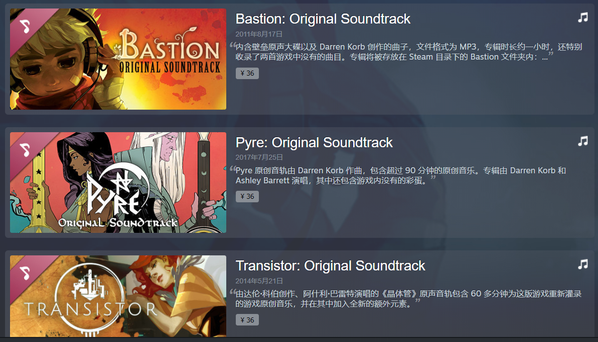
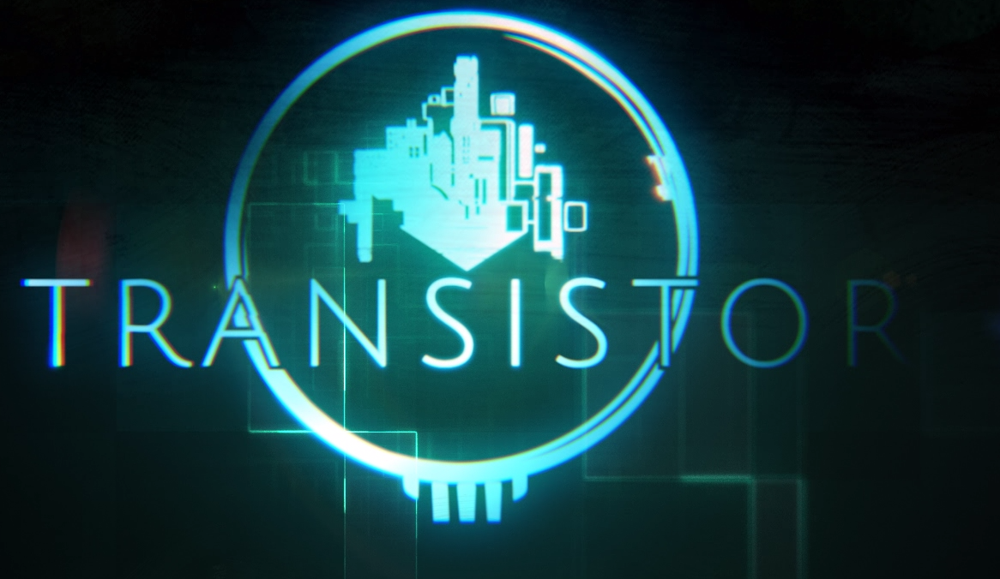
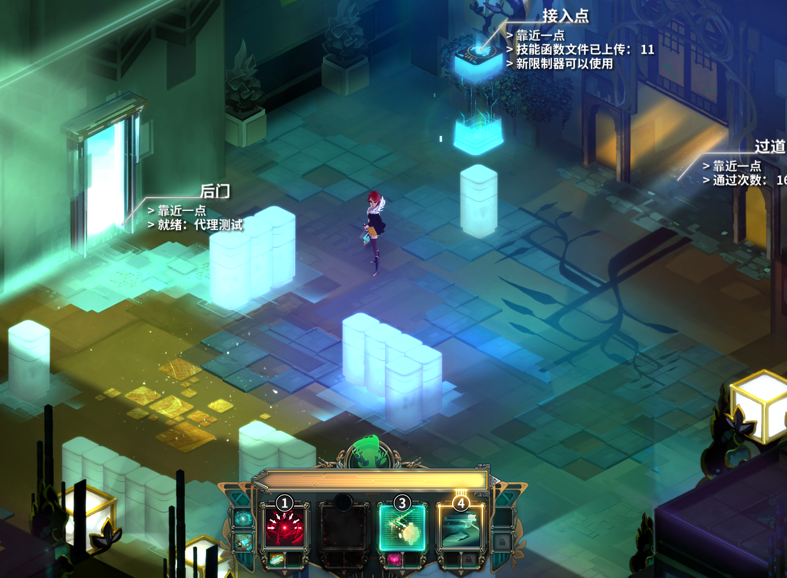
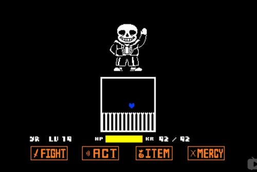
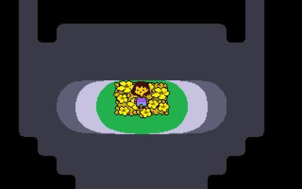

时至今日，游戏仍然是我不可或缺的精神食粮。高质量游戏，相较于读书可能是有过之而无不及，这或许也是游戏人愿称游戏为艺术的原因吧。 
对于一款游戏，其可以包含剧情、画面、音乐、可玩性等等，但是对于一款优质的游戏，这都是缺一不可的，否则就容易产生较大的断裂，从而影响玩家对游戏的体验。这次就来看看游戏的音乐吧。 

## SuperGaint games ##
SuperGaint一向以游戏的机制和画面广受好评，从最开始的Basion，到Transistor再到Pyre和Hades，每款游戏都在常规游戏的机制上进行了改革。游戏中的音乐同样都是精品，也难怪在steam会单独进行出售：

价格并非其高质量的衡量标准，本身具备的古典优雅也着实令人流连忘返。因为最近在重修Transistor所以对于SuperGaint的音乐从Transistor入手。 
### Transistor ###
首先，Transistor的故事发生在“云堤（Cloudbank）”，一个极具现代艺术气息的未来城市。一个名叫“红怜（Red）”的红发女歌手，被神秘组织所袭击，在收到致命攻击时却被男主角所救，男主角因此被刺，但意识留在了武器中，“红怜”就此与想要夺取该武器的“进程”和神秘组织进行战斗。 

从故事背景，（倘若还玩过游戏的话）能较为了解故事的场景，所以整个游戏的音乐基调都是现代化甚至科幻，外带着浪漫的色彩和忧伤（因为包含了一些剧透元素而不多展开）另一方面则是将音乐放在了正确的地方，从Old friend开始，到We All Become，每到一个如诗如画的场景，每当即将经历一场激烈的战斗，背景音乐都会有较大的变化，变化后的音乐足以让我沉浸其中，从而无法感受到背景音乐的存在，这或许是其音乐上极为成功的一点。但是接下要讲解的神作则是另一极。

## Undertale ##
Undertale这并非是一个齐名SuperGaint的公司名，而是一款游戏名称。他的画面是这样的：

或者是这样的：

在3A大作频出的今天，很难想到这样一部游戏居然能得到这些奖项：有14家媒体给予了满分评价，其他最低的不低于80分，平均分92分，获得24个奖项，甚至在PC端游戏中排名第10名！玩家的好评率也是极高的，这画面或许难以赢得我们的认可。但这样一款200MB不到，2GB内存都能运行的RPG为什么会广受好评呢？这无法脱离其变革性的剧情以及溢出情感的音乐。 
尽管剧情起到了很大的作用，但是倘若没有其音乐的“衬托”，我想是不会达到这样的效果的。
你打开了游戏，伴随而来的是清脆的音乐声，昭示着旅程的开始。
你以外的落到了一个洞窟里，内心是惴惴不安的，细听这背景音乐，似乎反映出内心的担心。当你为离开遗迹而不得以与爱你的羊妈作战时，背景响起heartache，展现出羊妈想要拦你却又摇摆不定的心情。遇到Sans时滑稽的音乐显示出他顽皮而怠惰的性格，和papyous战斗时背景音乐体现出他的傲娇，在寒冷的雪原漫步时背景音乐由清冷的钢琴和小提琴构成清冷的调子，让人感到荒芜与寒冷。还有之后的Ungyen，mettaton，玛戈菲特小姐姐对战时同样都能体现出对方的性格和紧张的气氛。最后与羊爸对战时因为无法逃跑和怜悯，因此背景音乐首先就体现出了没有退路的艰难，之后是决战的紧凑和充满希望的激昂心情。在真·结局与小花对战时，的hope and dream着实玩的我是一把鼻涕一把泪。 
Undertale用其音乐进行了场景的渲染，人物的烘托等等等等，掩盖住了其在图形上的欠缺，同时通过音乐来体现出人物的性格，如玛戈菲特的妖娆和羊妈的善良，种种这些都将音乐的作用发挥到了极致，倘若没有音乐，那么我想Undertale将会成为一个失败之作。

# 总结 #
最后回归主题吧，如果游戏没有了音乐，那么我们还能做什么，显而易见的，我们仍能体验游戏的可玩性和美妙的画面带给我们的愉悦和剧情带来的冲击。就像是一个被掏去了所有器官的人，啊不，那是死人。