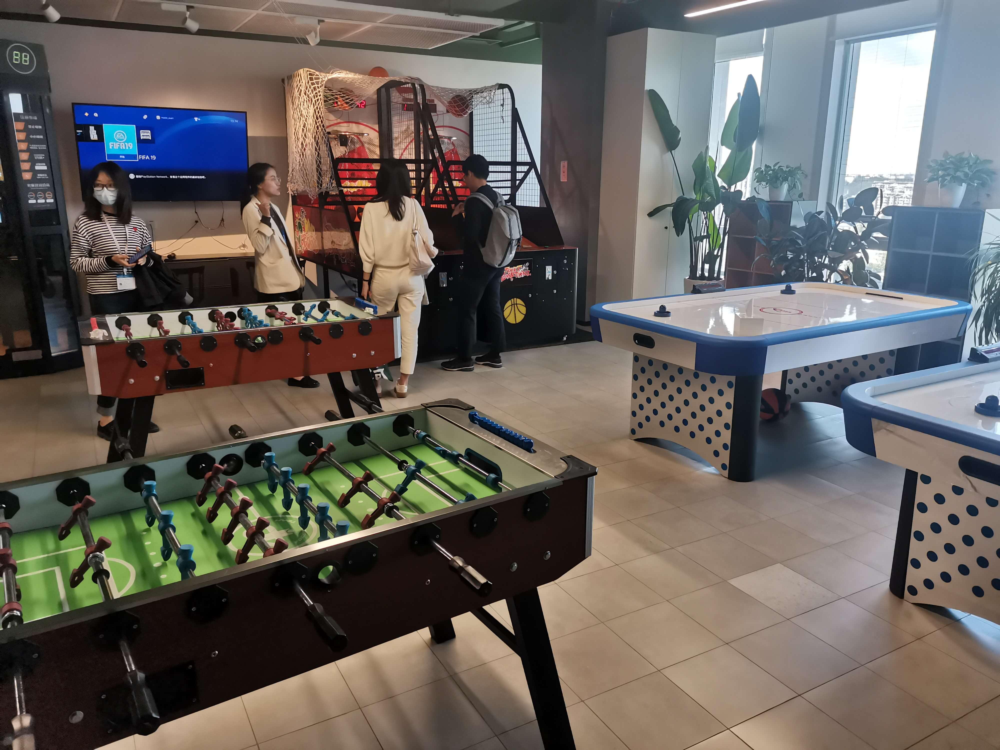
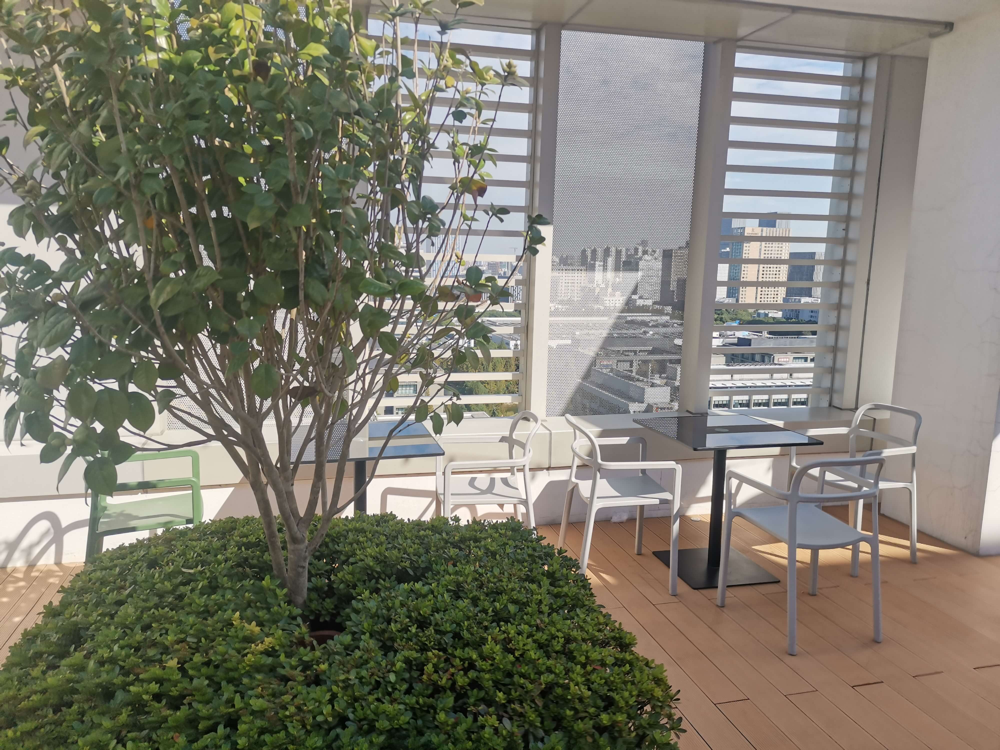

今日“有幸”参加字节跳动open day的参观，对于我这种没有简历没有工作经验和实习经验的人，这波不是一个跳板，是一个新的认知。
参观完之后的感受就是：大公司的风范，健身房、露天阳台、下午茶、咖啡厅...应有尽有，直接打破了这些东西只存在于美国硅谷的想法：

照片较为劣质就不多展示，总之在条件上确实令人羡慕。
或许这只不过是金玉其外，败絮其中？但是在参观的过程中发现各个员工的精神面貌确实十分高昂，没有想象中那么死气沉沉，在食堂交流问题的、在阳光照射下小憩的、健身的、打乒乓球的，像是压缩在一个一栋大楼里的大学，每个员工都充满着青春的朝气。 
**以上确实不是无脑吹，是给我的直观感受** 
当然参观也不能只看其外表，其企业文化也确实令我感到羡慕: **“只要要做，我们就要做到第一”，“和优秀的人做有挑战的事，务实的浪漫主义者。”，“开放谦逊 始终创业 坦诚清晰 务实敢为 追求极致 多元兼容”**: 
这些都是我在参过过程中提取出的关键字，这可能也确实是字节能在几年之内获得如此大成就的原因吧。
同时，我也与其中的员工和大佬进行了交谈，随和的性格就很容易交流，丝毫没有什么架势，也没有出自名牌大学的傲视（身处一堆上交华理的我只觉得自己菜），而是和蔼的与我们进行交流，我也就我的疑惑进行了提问，也听了模拟面试中面试官和研究生的交谈。在此之中收获的经验：
>1、在交流的时候要清晰坦诚地表达出来，不要浪费时间在交流上
>2、大厂或许看重的不完全是学历，较为重要的一点是实习经验和项目经历
>3、作为一个大企业，它广纳各类人才，也追求时代的进步，层出不穷的新项目和产品逐渐问世，对人才的需求也在不断变化，我们仍可以追逐风口专业，或者，我们可以在自己热爱的领域进行深耕，也许我属于后者

这并非我参观字节跳动的完全体验，这种大企业的气质确实对我有着很强的吸引力，但是唯有能力才有资格得到这样的未来。不是吗？
