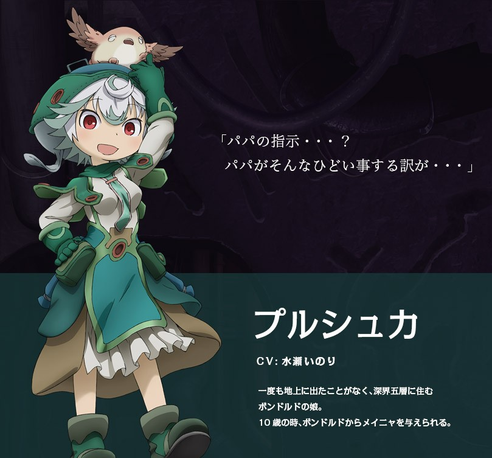

上周，通过一个小活动嫖到了一天的Bilibili大会员后，去观看了**来自深渊————深沉灵魂的黎明**，之前看过漫画版的，但是以剧场版的形式呈现，确实给了我更大的冲击，也可以看出制作组满满的诚意。
## 来自深渊
**来自深渊**早在2016年就已经实现了动画化，但是因为无人代理，所以是一个很小众的动画，我也是在看到了推荐才选择去观看的，确实无愧于年度奇幻No.1的称号，画面和音乐都十分的优秀，然而今天想说的，却是它的剧情


```
在每一个角落都被探索完毕的世界中，唯一残留的秘境——大洞穴“阿比斯”。
不知道延续到何方，深不见底的巨大纵向洞穴，栖息着奇妙奇怪的生物们，
沉眠着现在的人类无法制造的贵重遗物。“阿比斯”那充满了不可思议的姿
态吸引了人们，并驱使人们展开冒险。如此，多次挑战大洞穴的冒险者们，
陆续得到了“探窟家”的名号。

住在建造于深渊边缘的城镇“奥斯”的孤儿莉可，梦想着有朝一日成为母亲
那样伟大的探窟家，并解开深渊的谜团。这样的某一天，莉可在探索深渊
的途中，捡到了有着少年样貌的机器人…？
```
就剧情简介+精美的剧照，**Abyss**中的“力场”也同样令人感到惊奇，在这深不见底的洞穴中，探窟家下行不会产生影响，但是一旦想要上行，就会产生强度从头晕到直接死亡的**上升负荷**（取决于深度，越深，负荷越强），越接近深渊底层，就越难返回。

这场旅途对主角一行人而言必然是有来无回的，这或许已经开始揭示了这个故事的黑暗内核

## 向往深渊
女主角莉可，梦想追上自己的母亲“歼灭卿”莱莎，在遇到了无视上升负荷的机器人雷古之后，决意探索**Abyss**，开始的探险总是那么的美妙愉快，但是还没过多久，在第二层的监视基地，守护人“不动卿”奥森就向主角揭露了一个难以接受的现实：
```
主角莉可是从Abyss中生出来的，在出生的时候已经死亡，但是将她的尸体放入遗器“除咒之笼”带到地面时，却发现莉可重新复活了，但是……
```
经“除咒之笼”处理的**物体**会变得拥有生命，同时会渴望到达深渊底部，那么

**对深渊的向往究竟是莉可自己的想法还是除咒之笼的影响呢？**

我们无从得知。

在第五层，莉可因中毒而不得不切断手臂的时候，动画中呈现出来的内容，隔着屏幕都能感受到主人公的痛楚，画面不贴出来了，可以自己去看。在极端痛苦中她仍要求自己只折断骨头而不是将小臂直接截断，只为恢复之后仍能继续向下探索。

在最近看的**来自深渊————深沉灵魂的黎明**中，主要讲述主角一行人与白笛“黎明卿”之间的交集与交战，不能算的上是热血。往日点滴体现出“黎明卿”的温情，到他将“养女”做成
**“弹药包”**

对科学的无限热爱让他创造了自己的精神体，无限再生，漫长的岁月已经将他刻画为一个无情的科学机器，用生命残忍的进行试验，将孩童作为自己行动的工具。到最后，主角一行人终于绞尽脑汁“击败了”（精神上）“黎明卿”，但是发觉他在无形之中为主角一行人准备好了通往下一层的钥匙。最后也没有将这个“十恶不赦”的疯子杀死。

**倘若没有这样一个疯子存在，怎样才能更加深入的研究Abyss呢？**

这或许是作者的矛盾，也是给我们的一个思考，这确实是个疯子，肢解雷古，拿活人做实验，为满足自己的欲望？抑或是自己仍留的一丝温情，而这些都是对主角的考验？或许是矛盾的人，也或许是无心插柳，无论怎么说，对这样一个人都能深究，却无处考究。

## 黑暗故事中绽放的是光明的内核

```
abyss不是冒险家的乐园，而是冒险家的地狱
土笔章人似乎是想探讨————当所有的意义都消灭之后，探窟家是靠着什么继续向前的？
莉可首先被摧毁的，是目标与存在。
下一个被摧毁的，是赖以倚靠的雷格的强大实力。
黎明卿的章节，让探窟活动连最后的正当性都失去了。莉可和雷格为什么还要继续下降呢？
大概只是想下去看看，看看深渊的最底下有什么。
目标，身份，力量，正义都不重要。
重要的只是赤裸裸的“想看到”的欲望。
                                                    ———转载自知乎的一些评论
```
**在故事的结局到来之前，留白的手法将会一直存在，希望主角一行人能够继续走下去，
也希望在被摧毁之后的我们，仍能保持着向前的决心。**

